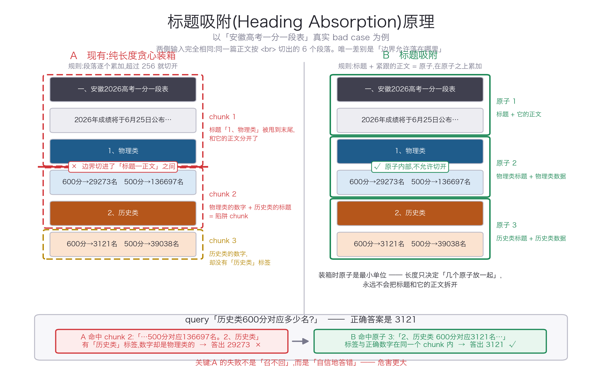

# Chunk 切分优化：标题吸附 + Section Path 前缀

针对现有 chunk 切分（按 `<br>` 切段 → 贪心合并至 ~256 中文字符 / 256 英文单词）的改进方案与 Demo。

## Bad case 与根因

**Case**：某高考一分一段表文章，「2、历史类」的标题被切到上一个 chunk 尾部，历史类正文落到下一 chunk；检索出来的 chunk 主体是历史类成绩、结尾却是物理类内容，语义错乱。

**根因**：

1. **标题孤儿**：标题行被当普通段落参与长度贪心合并，可被甩在 chunk 尾部，与正文分离；
2. **跨小节混杂**：合并对文档结构完全盲，一个 chunk 可同时装多个异质小节（物理类 + 历史类）；
3. **无 overlap 硬边界**：一旦切错没有冗余兜底，错误是致命的。

**关键性质**：这不是「召不回」（miss），而是「自信地答错」——chunk 里既有「历史类」又有「600分对应…名」，embedding/BM25 判定高度相关，于是把物理类的 29273 当成历史类的答案给出去。业务危害远大于答不出来。而物理段与历史段结构镜像、只有数字不同，**它们互为对方的难负例**。这条性质决定了整套评测的重心：不只测召回，更要测「会不会答错」。



## 改进方案（按 ROI 排序）

### 第 0 层：规则修复（本 Demo）

- **标题吸附**：标题与其正文构成原子「逻辑块」，合并/再切分都不可拆散；吸附是硬约束，长度是软约束（弹性区间 200~320 替代卡死 256）；
- **Section path 前缀**：每个 chunk 头部拼 `文档标题 > 一级小节 > 二级小节`，被切断的正文也有明确归属；chunk 跨小节时前缀自动退化为公共祖先；
- **可选 overlap**：只在相同 section path 的相邻 chunk 间重叠（跨小节重叠 = 另一种污染）；
- **句界对齐 + 超长枚举句兜底**（先逗号/顿号折行，最后才字符硬切）。

### 第 1 层：结构感知 + 语义校验

超长逻辑块内部按句界/语义细分；过短相邻块用 seqmodel 句向量相似度决定是否合并。挂载点：`chunk_blocks` 的合并判断处。

### 第 2 层：语义切分（需实验证明边际收益）

| 方案 | 成本 | 备注 |
|---|---|---|
| 相似度断点法 | 低 | 阈值敏感 |
| Max-Min 切分 | 低（embedding 本来要算） | 动态基准，优先试 |
| 边界分类器（seqmodel 微调） | 中 | 训练数据可远距离监督构造：标题/小节处为正例，段内采样为负例 |
| LLM 切分（LumberChunker / Meta-Chunking） | 高 | 建议只用于离线蒸馏训练数据 |

文献结论：chunking 的主要收益在生成端；语料库级检索中结构感知切分已是一线水平。语义切分的边际收益应在「结构区分 query」子集上验证。

## Demo 效果（bad case 原文对照）

```
旧规则：chunk#1 尾部挂孤儿标题「1、物理类」，chunk#2 物理/历史/下节混杂  -> 标题孤儿率 50%
新方案：标题与正文同块，历史类 chunk 自带 ... > 一、一分一段表 > 2、历史类 前缀 -> 孤儿率 0%
```

运行：

```bash
python3 heading_aware_chunker.py
```

三种模式对照输出：旧规则（复现 bad case）/ 新方案默认档 / 纯度模式（`keep_section_pure=True`，兄弟小节坚决不合并）。

## 三个实现怎么选

输入输出完全一致：含 `<br>` 的正文字符串 → chunk 字符串列表。

| 文件 | 行数 | 标题边界 | 标题传播 | 索引膨胀 | 定位 |
|---|---:|---|---|---|---|
| `heading_aware_chunker.py` | 403 | 硬约束 | section path 前缀 + 弹性长度 + overlap | 高 | 完整版，含上面第 0 层全部特性 |
| `chunk_simple.py` | 117 | 硬约束 | 全路径复制到每块 | +3.9% / +8.4% | 精简版 |
| `chunk_b1.py` | 147 | 硬约束 | **不传播** | **0** | 精简版，**推荐默认** |

### 为什么「不传播」反而当默认

在两篇真实文档（高考一分一段表 383 字 / 医美价格表 3923 字）上实测：

| 方案 | 高考·陷阱率 | 医美·索引膨胀 | 检测出错时贴错标题数 |
|---|---:|---:|---:|
| 原始贪心（基线） | 66.7% | — | — |
| `chunk_b1.py` 不传播 | **0%** | **0%** | **0** |
| 只传播直接标题 | 0% | 0% | 3 |
| `chunk_simple.py` 全路径 | 0% | +8.4% | 7 |

1. **消除陷阱只需要边界约束。** 传播与否对陷阱率毫无影响——保证「标题和它的正文同块」就够了。
2. **传播的收益面和风险面完全重合**，都只发生在「小节正文超过 max_size 被迫切开」的地方。而这类小节的实测占比：高考 0/5、医美 1/32（且那一个是无标题的导语）。**近零收益换非零风险。**
3. **检测出错时，不传播只会漏标签，传播会贴错标签。** 上表最后一列是用故意写坏的检测器（召回 60%）切出来的实测数——传播版把兄弟分支的标题贴到了无关正文上，等于自己造出了 bad case。漏标是 miss，贴错是「自信地答错」。

启用传播的条件（两个都满足才考虑）：**超 max_size 的小节占比 > 15%** 且 **标题识别召回 > 95%**。

> ⚠️ 这与上面「第 0 层 · Section path 前缀」的结论相反。前缀在设计上是对的（被切断的正文有明确归属），但实测在这类文档上用不上——小节天然够短，根本切不断。
>
> **如果索引层支持给 chunk 挂字段，更好的做法是把 section path 写进 metadata 而不是正文**：传播从切分期决策变成索引期开关，检测改好后不用重切就能重新生成，还能独立控制它是否进 embedding / BM25 / prompt。业界（LangChain `MarkdownHeaderTextSplitter`、LlamaIndex `MarkdownNodeParser`）都是这个设计，且默认把标题从正文里剥离。

### 标题识别的两个修复（都是在真实文档上发现的）

| 修复 | 原来的问题 | 影响 |
|---|---|---|
| 句末标点只挡 `。；`，**放行 `！？`** | 「二、价格表全曝光：光子嫩肤降价30%！」被判成正文 | 医美那篇漏 2 个一级标题，整节内容错挂到上一节 |
| 识别**无编号短标题**（≤30 字且不含数字） | 「四川省人民医院整形科价格表：眼部整形」没有编号前缀 | 同篇漏 10 个；该篇标题召回 60% → 100% |

「不含数字」是关键门：价格行、数据行都带数字，靠它和标题分开。**这是全部规则里误判风险最高的一条**，上线前抽 50 篇看准确率；拿不准就关掉——B1 的失败方向是良性的，准确率优先于召回率。

另外 `chunk_b1.py` **不需要标题层级**，只判「是不是标题」。少了层级就少掉「挂到错误父节点」整整一类 bug，这是它比传播版简单的根本原因。

### 不变量（`chunk_b1.py` 的 `__main__` 里已断言）

1. **零复制**：`sep=''` 时 `''.join(结果)` 恒等于原文各非空段落的拼接
2. **无孤立标题**：任何 chunk 都不以标题结尾
3. **无纯标题 chunk**

第 2 条不成立 = 装箱逻辑有 bug；第 2 条成立但效果仍差 = 标题识别的问题。两类问题靠它分开查，别混在一起。

已知软违约：小节正文超长必须内部切开时，第一片会带上标题，可能超出 `max_size` 最多一个标题的长度（为了不产生纯标题 chunk）。要严格卡死就把首片预算改成 `max_size - len(标题)`。

## 实验设计要点（语义切分 vs 规则切分）

1. **变量控制**：唯一变量 = 切分策略；控制 chunk 长度分布一致；基线用修复后规则而非旧规则；
2. **评测集**：线上 query 日志分层抽样 2k~5k，点击日志弱监督（排名≤3 + 长停留 + 末次点击）+ 小样本精标校准；chunk 级 ground truth 用「答案最小文本区间与 chunk 有重叠即命中」；
3. **关键子集**：构造「同实体不同属性分支」query（历史类 vs 物理类位次），对 chunk 语义纯度最敏感；
4. **指标**：Recall@K / nDCG@10 / MRR（MaxP 聚合到文档级）+ 标题孤儿率/跨小节率（归因）+ 成本；
5. **显著性**：per-query 配对 bootstrap / Wilcoxon，p<0.05，分层报告；
6. **前置 oracle 分析**：统计规则方案中答案区间被切断的比例，先估天花板再决定投入。
7. **先量标题识别的 P/R，再谈切分对比**：抽 30~50 篇人工标真标题。医美那篇标题召回只有 60%，导致标题吸附在这篇上基本没赢基线、局部还更差。**召回 < 85% 时「吸附 vs 基线」的对比不成立**——分不清是方向错还是正则烂，而这两者的结论完全相反（砍方向 / 改正则）。
8. **精度侧指标不能只看召回**：Chroma 实测 13 种切法，Recall 全距只有 8.3pp，IoU 全距差 5.7 倍。只统计「完整命中率」极可能得出「几种切法都差不多」的错误结论。我们这两篇文上就是：完整命中率各方案全部 100%，是**陷阱率**把它们劈开的。
9. **陷阱判定要加距离门限**：纯子串规则会误判。很多文章的导语把并列类别都提一遍（「本文整理了历史类和物理类的数据」），于是一个**完全正确**的 chunk 也同时含「历史类」和物理类的数字 → 被判成陷阱。要求「必需信息」出现在「错误答案」的 120 字邻域内才算，并把两个口径都报出来。
10. **结果按文档类型分层报**：dsRAG 在 KITE 上隔离出标题传播的独立贡献，四个数据集分别是 +0.2 / +3.7 / +0.1 / +1.3——**两个数据集基本等于零**，唯一暴涨的是 10-K 财报（多小节 + 相似数字 + 靠标签区分，和一分一段表、价格表同类）。只报一个平均值会被「那你为什么要全量上」问死。

## 接入待办

- 按真实语料补 `_HEADING_PATTERNS` 模式与数据行保护规则（连续短编号行 = 列表整体保留）；
- 抽样验「无编号短标题」规则的准确率（当前最大误判风险源），不达标就关掉；
- 编号体系按文档内首次出现顺序**动态定级**，别硬编码——存在「`1、` 当一级、`一、` 当二级」的文档；
- 打点：标题孤儿率（目标 0）、chunk 长度分布、跨小节率、**超 max_size 小节占比**（决定要不要传播）。
