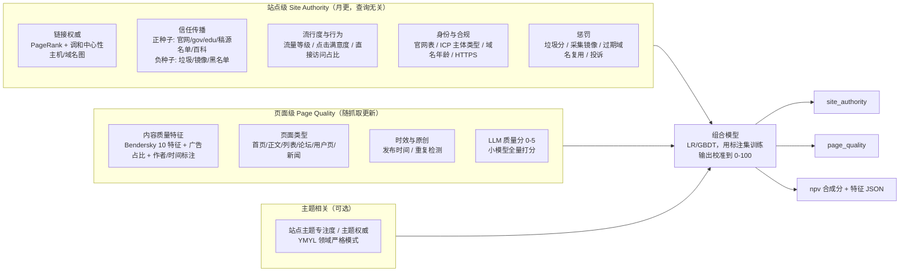

# 网页权威度（Page Authority）方案调研报告

- 日期：2026-09-05
- 目的：回答"如何把网页权威度做准"。梳理业界（Google、Bing、百度、Yandex、第三方 DA/DR/TF 指标、LLM 时代的来源可信度）与学术界（链接分析、行为信号、内容质量先验、可信度建模、评测方法）的做法，对照当前 `PageValueScore` 模型找差距，给出优先级明确的行动建议。
- 与本报告配套的短文档：`最紧迫行动清单与对齐问题.md`（同目录）。
- 引用方式：正文中以 [G1]、[A3] 这类编号指向附录 A 的资料清单。凡属泄露文档、行业媒体解读、非官方博客的信息，均在文中标注"（解读/非官方）"，不能作为事实依据，只能作为方向参考。

---

## 0. 核心结论（先读这一节）

1. **业界没有人用一个分数解决"权威度"。** Google、Yandex、百度都把它拆成至少三层：站点级信任/权威（查询无关、变化慢）、页面级质量（内容本身）、主题相关的权威（在某领域是否是"go-to source"）。当前 npv 模型只有第一层，且第一层只有四个手工加权的站点表特征。
2. **站点级权威的主流做法是"链接图 + 种子信任 + 行为/流量 + 惩罚"四路合成。** PageRank 类链接分数是底座，TrustRank/Majestic Trust Flow 这类"从人工审核的可信种子出发传播"的方法负责抗操纵，浏览/点击/流量负责校正"链接多但没人用"的站点，垃圾/惩罚信号负责兜底。四路缺一路，分数就有明显的可被利用的盲区。
3. **Google 已被证实维护站点级权威分。** 2023 年反垄断诉讼披露 Q*（站点级质量/可信度分，工程手工设计为主）与 Navboost（13 个月点击数据），2024 年内部文档泄露出 `siteAuthority`、`hostAge`、`siteFocusScore`、`chromeInTotal` 等字段（解读）。这与 Google 多年公开否认"域名权威度"相矛盾，但也说明：**站点级分数是行业事实标准，而不是可选项。**
4. **可信度（Trust）优先于权威度。** Google 2025 年 9 月版评分员指南明确"Trust 是 E-E-A-T 的核心"，要求评分员对每个页面做"声誉调研"（查独立第三方评价、新闻、百科、专业机构推荐），且 YMYL（健康、金融、安全、政务）主题标准更高。百度《优质内容解读》同样把"专业性与权威性"放在"资质证明、领域聚焦、行业知名度"上。**一个只看链接与流量、不看负面信号的模型会系统性地高估骗局站与采集站。**
5. **学术界最有用的三条结论：**（a）页面内容质量可以用十来个线性可算的特征（可见词数、停用词比例、锚文本比例、信息噪声比、URL 深度、表格文本比例等）显著提升检索效果（Bendersky 2011）；（b）用户浏览图上算的重要性优于链接图（BrowseRank 2008）；（c）不同机构给出的域名可信度评级高度一致（Lin 2023，六套专家评级、11,520 个域名），说明"站点可信度"是可以被稳定标注和学习的目标。
6. **LLM 改变了两件事：** 标注成本（LLM 做相关性/质量标注与人工一致性接近人与人之间的一致性，Bing 已在用）与使用场景（AI 搜索/RAG 把"来源可信度"从排序特征变成了硬性过滤条件；2026 年一项研究显示开放网页检索的回答中 35% 引用了至少一个不可信来源）。这意味着权威度分数很快会有第二个消费方：生成式搜索的来源筛选。
7. **当前最紧迫的不是加特征，而是三件基础设施：** 定义与用途对齐、建立黄金标注集与离线评测、把已修复的 P0 版本跑起来得到可复现的基线。没有这三件，任何权重调整都无法证明"更准"。之后再按"零成本站点级信号 → 页面级质量特征 → 数据驱动的组合"的顺序推进。

---

## 1. 问题定义：先说清楚"权威度"是什么

### 1.1 四个常被混用的概念

| 概念 | 回答的问题 | 典型信号 | 变化速度 |
| --- | --- | --- | --- |
| 权威度 Authority | 在这个主题上，这个来源是不是公认的"该去看的地方"？ | 入链、引用、被提及、官方身份、专业资质 | 慢（月级） |
| 可信度 Trust / Credibility | 这个来源说的话可靠吗？会不会有害？ | 事实准确率、负面声誉、垃圾/欺诈判定、合规备案 | 慢，但可以瞬间归零 |
| 质量 Quality | 这个页面本身写得好不好、能不能用？ | 正文长度、可读性、广告占比、原创性、结构 | 页面级，随内容变 |
| 流行度 Popularity | 多少人在用？ | 流量、点击、浏览时长、品牌搜索量 | 快（天/周） |

业界的做法是：**站点级合成"权威 + 可信 + 流行"，页面级单独算"质量"，最后在排序模型里作为查询无关的先验（prior）使用。** 当前 npv 的 `score()` 把这四样揉在一个乘法链里，是差距的根源之一。

### 1.2 用途决定定义

同一个"权威度"分数，用途不同，正确的做法也不同：

| 用途 | 需要的粒度 | 校准要求 | 对错误的容忍 |
| --- | --- | --- | --- |
| 主搜排序的先验特征 | 页面级为主，站点级作为特征 | 只需单调、分布稳定 | 高（排序模型会再学一遍） |
| 索引分层 / 高质量网页库筛选（当前 `isScroll=1` 的用法） | 站点级 + 页面级 | 需要阈值语义稳定（"前 20% 是什么"） | 中 |
| 生成式搜索 / RAG 的来源过滤 | 站点级为主，YMYL 需页面级 | 需要绝对语义（"可信/不可信"） | 低（引错来源直接出事故） |
| 爬取调度、刷新频率 | 站点级 | 只需相对序 | 高 |

**这是需要与你对齐的第一件事。** 见配套文档的问题 1。

### 1.3 "做准"的含义

"准"有三种可度量的含义，缺一不可：
- **序准**：人工认为 A 比 B 权威，分数也是 A > B（pairwise accuracy / Spearman）。
- **档准**：分数在 90 分以上的站点，人工复核确实是权威站的比例（top-k precision）；分数在 20 以下的确实是低质/垃圾的比例。
- **稳准**：同一站点在两次运行间、在无实质变化时分数不漂移；输入缺失时行为中性。

当前项目没有任何一种"准"的度量手段，这是第 6 节第一条建议的原因。

---

## 2. 业界方案

### 2.1 Google：从 PageRank 到多层站点质量体系

**公开口径。** Google 官方的排序系统清单 [G3] 里与权威/质量相关的系统有：链接分析与 PageRank（站点/页面级）、可靠信息系统（提升权威来源、降低低质内容，低置信度时加内容提示）、垃圾检测（SpamBrain）、基于删除请求的降权（站点级：大量法律删除、个人信息投诉的站点整体降权）、精确匹配域名系统（站点级）、站点多样性（同站最多两条）。Panda（2011，站点质量）、Penguin（2012，链接垃圾）、有用内容系统（2022，站点级分类器）都已并入核心排序，不再单列。Google 在有用内容系统的说明中明确过它是**站点级信号**：一个站点存在大量无用内容会拖累该站其他页面的表现。

**评分员指南（2025 年 9 月 11 日版，182 页）[G1]。** 这是 Google 对"什么是高质量/权威"的最权威公开定义，也是构建标注集的最佳蓝本：
- E-E-A-T = 经验、专业、权威、可信。原文："The most important member at the center of the E-E-A-T family is Trust." 不可信的页面无论多专业都是低 E-E-A-T。
- 权威的定义是"是否被公认为该主题的 go-to source"；"大多数主题没有唯一的官方权威站点，但有的时候（如护照办理的政府页面），该站点通常是最可靠的来源"。
- **声誉调研是每个评分任务的必做项**（3.3 节）。方法：找到站点首页 → 搜索 `[品牌 -site:该站]`、`[品牌 reviews -site:该站]` → 看独立新闻、维基百科、专业协会推荐、奖项、争议。**明确说 Similarweb 之类的流量数据不是声誉证据。** 站点自述（About us）只能作为起点，"对有明显利益冲突的自我陈述保持怀疑"。
- YMYL（健康、金融、安全、社会福祉，2025 年起明确含政务/选举）主题用最高标准，声誉证据必须来自该领域的专家。
- 2025 年版新增了 AI 内容规则和三类垃圾（过期域名滥用、规模化内容滥用、站点声誉滥用）[G5]。

**内部实现（诉讼披露 + 文档泄露，均为解读，不作事实依据）[G4][G6]。**
- 2023 年反垄断诉讼：排序由三块组成，ABC 信号（Anchors 锚文本、Body 正文、Clicks 点击）、Navboost（13 个月的聚合点击数据：good click / bad click / last longest click）、Q*（站点级质量/可信度分，"主要由工程师手工设计而非机器学习"）。Q* 与 PageRank 是两回事：链接多的站点可以 Q* 很低。
- 2024 年 Content Warehouse API 文档泄露（2,596 个模块、14,014 个属性）中与站点级权威相关的字段：`siteAuthority`（在 CompressedQualitySignals 中，"用于 Q*"）、`hostAge`（域名首次被发现的天数，"用于在服务时沙箱化新垃圾"）、`siteFocusScore`（站点主题专注度）、`siteRadius`（页面与站点主题的偏离）、`chromeInTotal`（站点级 Chrome 浏览量）、`smallPersonalSite`、`pandaDemotion`/`babyPandaDemotion`、`navDemotion`、`exactMatchDomainDemotion`、`anchorMismatchDemotion`、`unauthoritativeScore`、`scamness`、`spamrank`、`homepagePagerankNs`（新页面暂借首页的 PageRank）、`isElectionAuthority`/`isCovidLocalAuthority` 这类**白名单布尔位**。
- 对我们的启示不在字段名，而在结构：**链接（PageRank 近种子变体）+ 浏览器行为（Chrome）+ 主题专注度 + 域名年龄 + 一组独立的降权/垃圾分 + 关键领域白名单**，且新页面继承站点分。这正是"四路合成"的完整形态。

**2024-2026 的政策走向 [G5][G7]。** 反垃圾重点转向三类站点级滥用：过期域名复用、规模化（AI）内容、寄生在高权威站点上的第三方内容（site reputation abuse）。2026 年 5 月 27 日 Google 把"首选来源"（Preferred Sources）扩展到 AI Overviews 与 AI Mode，并增加"高引用"（highly cited）标签，即 AI 回答的来源选择逻辑与蓝链排序开始分离。

### 2.2 Bing：Authority / Utility / Presentation

Bing 2014 年公开的内容质量框架 [B1][B2] 把质量分为三根柱子，其中 Authority 回答"能否信任这个内容、作者、站点"，信号包括：社交网络中的提及、引用来源、知名度、作者身份。Bing 明确不同查询领域权威的判法不同（健康类偏好专业机构与专业作者）。业界普遍归纳 Bing 还看重作者署名与资质、域名年龄、来自 .gov/.edu 等权威站点的链接、社交信号。Bing 同时是 MSLR 学习排序数据集 [A11] 的来源，该数据集的 136 维特征里就有 `PageRank`、`SiteRank`（站点级 PageRank）、`QualityScore`、`QualityScore2`、URL 点击数、URL 停留时间等查询无关特征，说明**站点级排名分 + 页面质量分 + 行为分**在 Bing 的排序模型里是三个独立特征。

### 2.3 百度：白皮书、优质内容解读与 AI 时代的站点级判别

- **《百度搜索引擎网页质量白皮书》[P1][P2]** 把网页质量分为三个维度：内容质量（正文完整、有价值、非采集）、浏览体验（排版、广告、弹窗、对比度）、可访问性（打开速度、登录墙、恶意软件）。白皮书披露初期仅 7.4% 网页达到优质标准、21% 为低质；经算法升级，搜索结果中优质网页占比提升到 40%、低质降到 11%。
- **《百度搜索优质内容解读》[P3]** 的五个维度：需求满足度、专业性与权威性、内容质量、用户体验、辅助信息。权威性的判据是：**领域聚焦**（"不应该过杂"，与 Google 的 `siteFocusScore` 同构）、**身份背书**（医疗执照、从业背景等专业证明）、**行业知名度**（在专业领域持续输出）。百度推广的《权威性解读》[P4] 同样强调"补充自身在相关领域的专业证明"。
- **第三方"百度权重"不是官方指标 [P5]。** 爱站、站长之家的 0~9/0~10 级"权重"是按"有排名的关键词 × 关键词指数 × 排名位置点击率"估算流量后分级，与百度内部无关。它能说明的只是"这个站在百度有多少自然流量"，是流行度而非权威度，但作为一个**外部流行度参照**在中文站点上比 Tranco/CrUX 覆盖更好。
- **2026 年动向（非官方渠道，需核实）[P6]。** 有站长博客称百度在 2026 年一季度上线了新的 AI 内容识别模型，同时考察页面结构、发布时间、作者历史与**站点整体内容模式**，并区分"AI 辅助"与"AI 堆砌"；2026 年 3 月百度 AI 搜索全面上线，问答类查询顶部出现引用多个网页的 AI 摘要。方向与 Google 一致：站点级模式识别 + AI 摘要的来源选择。

### 2.4 Yandex：唯一公开的官方站点质量分 SQI，以及泄露的主机级因子

- **SQI（Site Quality Index，俄文 ИКС）[Y1]** 是 Yandex 2018 年替代旧的 TIC（主题引用指数）推出的、在站长平台公开显示的站点质量分。官方说明："显示您的站点对用户有多有用、多方便"；基于"Yandex 服务的数据"，考虑"**受众规模、用户满意度、用户与 Yandex 对该站点的信任程度**"；会考虑站点在 Yandex 地图、Zen、市场等其他平台上的存在；定期重算（业界观察为月更）；**主域、镜像、子域分别计算**；发现作弊或试图影响 SQI 时可**清零并取消指标**。这是一个把"流行度 + 满意度 + 信任"合成为一个 0 到几万的整数、并公开给站长的工业实例，也说明**用户行为是站点权威度的一等公民**。
- **2023 年源码泄露（解读）[Y2][Y3]** 列出约 1,922 个排序因子（其中约 64% 标为弃用或未用）。与站点权威相关且被多方解读为在用的：PageRank 变体；来自 PageRank 前 100 站点的链接；首页链接比内页链接权重高；好链接/坏链接比例；链接年龄与主题相关性；**直接访问流量占比**、独立访客数、搜索引流占比；是否安装 Yandex.Metrica；广告与内容比例；4xx/5xx 错误比例；从首页到页面的爬取深度；维基百科等站点直接偏好；YMYL 领域专项因子。**"停留时间"被大量标为弃用**，业界据此认为 Yandex 用的是更粗的满意度信号（如是否返回搜索结果页）而非原始停留时长。

### 2.5 第三方站点权威度指标：四家的方法论对比

这四个指标是 SEO 行业事实上的"域名权威度"标准，方法论各有取舍，恰好覆盖了四种可行的建模思路 [T1]~[T5]：

| 指标 | 核心方法 | 输入 | 抗操纵手段 | 与 npv 的可类比处 |
| --- | --- | --- | --- | --- |
| Ahrefs DR（Domain Rating） | 域名级 PageRank：高 DR 域名传递更多"权重"，源域名把权重**在其出链的所有域名间平分**；绝对值再缩放到 0~100 | 仅链接（通常认为仅 dofollow，对数刻度） | 出链越多传递越少 | 现在的 `spr`（站点 PR）就是这一类 |
| Moz DA（Domain Authority，2.0 版 2019 起） | 机器学习**预测该域名相对其他域名在搜索结果中的排名能力**，输入链接数据并纳入 Spam Score | 链接 + 垃圾分 | 训练目标是真实排名，垃圾分显式建模 | 数据驱动组合的范例 |
| Majestic Trust Flow / Citation Flow | TF：从**人工审核的可信种子站点**出发沿链接传播（TrustRank 的工业实现）；CF：纯链接数量/权重；Topical TF 给出按主题的权威度 | 链接 + 人工种子 | TF/CF 比值低 = 链接多但不可信 | 现有 `ow`/白名单可以升级为种子传播 |
| Semrush Authority Score | 神经网络合成三部分：链接权重、**预估自然流量**、垃圾因子（链接画像是否自然） | 链接 + 流量 + 垃圾 | 流量校正 + 垃圾因子 | 四路合成的范例 |

一项 2023 年的独立研究比较了 Moz、Semrush、Ahrefs 三家分数的一致性 [T5]，结论是三者高度相关但绝对值不可互换。**对我们的启示：** 哪一种方法都能得到"看起来合理"的分数，真正的差别在抗操纵与校准目标；如果只能选一种升级路径，"人工种子 + 传播"（Majestic/TrustRank）性价比最高，因为项目已有官网表、区域白名单与 adc 白名单，只差把"列表匹配"换成"图传播"。

### 2.6 可以直接拿来用的公开站点级数据源

以下资源许可宽松、覆盖面大、可以作为**外部校验集或冷启动特征**（生产使用需确认许可与合规，见对齐问题 9）：

| 资源 | 内容 | 规模/频率 | 用法 |
| --- | --- | --- | --- |
| Common Crawl 主机图/域名图 [D1][D2][D3] | 每个主机/域名的 **PageRank 与调和中心性**（harmonic centrality），并有归一到 0~10 的 `prank10`/`hcrank10`；host index 还含抓取状态（2xx/4xx/5xx 比例）、语言占比等字段 | 最新版 `cc-main-2026-jun-jul-aug`（2026-08-25）；2025 年 5 月版有 3.27 亿主机、29 亿边；1.56 亿域名、21 亿边；季度级更新 | 若内部没有链接图，可直接 join 作为站点级链接权威；调和中心性比 PageRank 更难被链接农场操纵 |
| Tranco [D4] | 聚合 Cisco Umbrella、Majestic、Farsight、CrUX、Cloudflare Radar 五个来源的前 100 万站点榜，专为研究设计、抗操纵 | 日更 | 流行度等级特征；也可用于校验 |
| Chrome UX Report 榜单 [D5] | 基于 Chrome 真实用户流量的站点榜，按 1k/5k/10k/50k/100k/500k/1M/5M/10M 量级分桶；研究表明比 Alexa/Tranco 更准 | 月更 | 流行度量级特征（注意中国大陆覆盖偏低） |
| 国家网信办《互联网新闻信息稿源单位名单》[D6] | 2021 年 10 月版 1,358 家可被转载的新闻稿源（中央与地方新闻网站、行业媒体、政务平台、公众账号、应用程序） | 不定期 | **中文新闻类权威种子的最佳官方来源**，比 `.gov.cn/.edu.cn` 后缀精细得多 |
| 新闻域名可信度聚合评级 [D7] | Lin 等 2023 年聚合六套专家评级（NewsGuard、MBFC 等）得到 11,520 个域名的可信度分，六套评级之间高度一致 | 静态 | 英文新闻域名的可信度校验集；也是"可信度可以稳定标注"的证据 |
| CRED-1 [D8] | 2026 年发布的 2,672 个不可信/讽刺/阴谋类域名数据集，附域名年龄（WHOIS/RDAP）、Tranco 排名、事实核查频次、Safe Browsing 威胁情报 | 静态 | 负样本与"域名年龄 + 流行度 + 威胁情报"多信号建模的参考 |
| ICP 备案、WHOIS 域名年龄 | 中国站点的合法经营标识；域名注册时长 | 可批量查询 | Google 用 `hostAge` 沙箱化新域名、钓鱼域名中位年龄约 60 天的研究均支持"新域名先降权"；ICP 主体类型（政府/事业单位/企业/个人）可作为身份特征 |
| 维基百科外链与"可靠来源"列表 | 被百科条目引用的域名、编辑社区维护的来源可靠性表 | 持续 | 权威种子的补充；Google 评分员指南也把百科条目列为声誉证据 |

### 2.7 LLM 时代的两条新线：预训练数据质量分与 RAG 来源可信度

- **网页质量分类器已经工业化。** FineWeb-Edu 用 Llama-3-70B 给 50 万网页打 0~5 分"教育价值"，再训练一个小回归模型全量打分（阈值 3 的 F1 为 82%）[L1]；DCLM 用 fastText 在约 40 万文档上训练"信息量"分类器；Nemotron-CC 集成多个分类器 [L2]；中文有 OpenCSG 的 Chinese-FineWeb-Edu，用 BERT 给中文网页打 0~5 分，已开源分类器 [L3]。**这条路线对页面级质量分的启示是：用 LLM 标注几十万样本，训一个便宜的小模型全量打分，比手写 if-else 位标记规则更准也更好维护。**
- **RAG 把来源可信度变成了硬约束。** RA-RAG（2024-2025）通过跨来源交叉验证估计每个来源的可靠性，再只从"最可靠且相关的 top-κ 来源"检索并加权投票 [L4]；2026 年 7 月一项对公共 AI 信息服务的评估显示，开放网页检索的回答中 **35% 至少引用了一个被专家标记为不可信或不相关的来源**，而仅靠提示词里给可信域名列表只把引用率从 12% 提到 21% [L5]。结论：**来源可信度必须在检索层作为特征或过滤器，而不能寄望于生成模型自己判断。**
- **LLM 可以直接给域名打可信度分，但需校准。** Yang & Menczer 让 ChatGPT 给新闻域名评级，LLM 之间一致性高（Spearman 约 0.79），与人类专家评级只有中等一致（约 0.50），且分数整体偏高 [L6]。另一方面，Thomas 等（SIGIR 2024，Microsoft）证明经过挑选的 LLM + 提示词做相关性标注，与真实用户偏好的一致性不低于第三方人工标注员，Bing 已用于生产标注 [L7]。**结论：LLM 适合做"标注加速器"和"辅助特征"，不适合作为唯一裁判。**

---

## 3. 学术方案

### 3.1 链接分析：从 PageRank 到"主机图 + 正负种子"

- **PageRank**（Page & Brin，1998）[A1]：随机冲浪者模型，查询无关的页面重要性先验。弱点众所周知：链接农场、页面数量膨胀、悬挂节点，页面级噪声大。
- **HITS / SALSA**（Kleinberg 1999；Lempel & Moran 2000）[A2]："权威（authority）"一词的学术来源：在查询相关子图上区分"枢纽页"与"权威页"。**主题敏感 PageRank**（Haveliwala，WWW 2002）按主题分别计算 PR 向量，是"主题权威"的原型，对应 Google 泄露文档中的 `siteFocusScore`/主题嵌入与 Majestic 的 Topical Trust Flow。
- **HostRank**（Eiron、McCurley、Tomlin，WWW 2004）[A3]：在主机图（约 1,970 万主机、11 亿边）而非页面图上计算，把悬挂节点的概率转移到主机而与主机内页面数无关，**直接抵消"造页面刷权重"的操纵**。结论对我们很重要：站点级图更小、更稳、更难操纵；页面分可以由"站点分 + 页面在站内的位置"派生（Google 让新页面暂借首页 PageRank 就是这个思路）。
- **信任传播**：TrustRank（Gyöngyi、Garcia-Molina、Pedersen，VLDB 2004）[A4] 从人工审核的可信种子（偏好出链多的页面）出发做有偏 PageRank；Anti-TrustRank（Krishnan & Raj，2006）[A5] 从已知垃圾种子沿入链反向传播"不信任"；Topical TrustRank（Wu 等，WWW 2006）[A6] 按主题选种子，避免种子主题偏置；后续工作同时传播信任与不信任并区分目标（Zhang 等，TWEB 2014）[A7]。**Majestic 的 Trust Flow 就是 TrustRank 的商业化。**
- **链接垃圾特征**：Becchetti 等（TWEB 2008）提出 Truncated PageRank、支持者估计等特征；Castillo 等（SIGIR 2007，"Know your neighbors"）[A8] 在 WEBSPAM-UK 数据集（约 10 万主机）上证明链接特征 + 内容特征 + **邻居平滑**（垃圾站成簇）的组合效果最好。这些数据集（WEBSPAM-UK2006/2007）至今是评测链接权威抗操纵性的公开基准。
- **调和中心性**（Boldi & Vigna，2014）[A9]：节点到其他节点最短距离倒数之和。Common Crawl 选择它作为主排名指标，业界普遍认为它比 PageRank 更难用人工链接结构抬高。

### 3.2 行为信号：让用户投票

- **BrowseRank**（Liu 等，SIGIR 2008 最佳学生论文）[A10]：用浏览器日志构造"用户浏览图"（页面为点、跳转为边、停留时长为连续时间参数），在垃圾抑制与相关性两项任务上都优于 PageRank 与 TrustRank。理由：链接由站长控制，可以任意加删；浏览行为由用户产生，操纵成本高得多。后续有 Fresh BrowseRank（2013）与 BrowseGraph 局部排名（2015）。
- **点击类信号**：Google 的 Navboost（good/bad/last-longest click，13 个月聚合）、Yandex 的直接访问占比与独立访客、Bing MSLR 数据集里的 URL 点击数与停留时间 [A11]，都是同一思路的不同实现。注意 Yandex 泄露代码把大量"停留时间"因子标为弃用，说明**原始停留时长噪声大，工业上更常用"是否返回结果页""是否二次搜索"这类满意度代理**。
- **注意事项**：位置偏置（排在前面的点得多）、长尾站点稀疏、隐私合规。行为信号更适合做站点级聚合与校正，而非页面级主分。
- **URL 结构先验**：Kraaij 等（SIGIR 2002）[A12] 证明入链数与 URL 类型（根、子根、路径、文件）作为先验能显著提升入口页检索；URL 深度是最便宜的"首页程度"特征，Bendersky 的特征表也收录了它。

### 3.3 内容质量先验：页面本身写得好不好

- **Zhou & Croft**（CIKM 2005）提出把文档质量（与集合语言模型的散度、信息噪声比等）作为语言模型检索的先验。
- **Bendersky、Croft、Diao**（WSDM 2011，"Quality-Biased Ranking of Web Documents"）[A13]：用十个**线性时间可算**的内容特征作为查询无关项直接加进检索模型，在两个大规模网页集合上稳定、大幅优于纯文本模型与 PageRank 先验。特征表（原文 Table 2）：

  | 特征 | 含义 | 反映的质量因素 |
  | --- | --- | --- |
  | numVisTerms | 浏览器渲染后可见的词数 | 内容量（对应现在的 pureTextLen） |
  | numTitleTerms | `<title>` 词数 | 元数据描述性 |
  | avgTermLen | 可见词平均长度 | 可读性 |
  | fracAnchorText | 锚文本占比 | 过高说明是导航/列表页、无自有内容 |
  | fracVisibleText | 可见文本 / 全部源码 | 信息噪声比 |
  | entropy | 词分布熵 | 主题聚焦度 |
  | fracStops | 停用词占比 | 是否像正常自然语言（关键词堆砌会异常） |
  | stopCover | 停用词表被覆盖的比例 | 同上 |
  | urlDepth | URL 路径深度 | 在站点层级中的位置 |
  | fracTableText | 表格文本占比 | 版式（大量表格文本通常不是可读正文） |

  其中多项源自 Ntoulas 等（WWW 2006）的内容型垃圾检测特征（词数、标题长度、锚文本比例、可见比例、可压缩性、n-gram 似然）。**这十个特征几乎都能在现有解析流水线里顺手产出**，是页面级质量最便宜的升级。
- **LLM 质量分类器**（见 2.7）是这条线的当代版本：用 LLM 给样本打 0~5 分，训练小模型全量打分。

### 3.4 可信度建模：从"看起来可信"到"说的是真的"

- **感知可信度**：Olteanu 等（ECIR 2013）[A14] 从内容、链接结构、页面设计、社交流行度中提取 37 个特征，其中 22 个对预测可信度有效；Kakol 等（IP&M 2017）的 Content Credibility Corpus [A15] 含 2,000 多名标注者对 5,543 个页面的 15,750 次评估，附外观、完整性、作者专业性、意图四个维度。这两项工作证明可信度**可以被众包稳定标注并被监督学习预测**。
- **事实可信度**：Knowledge-Based Trust（Dong 等，Google，VLDB 2015）[A16] 不看链接，看来源提供的事实是否正确：从 1.19 亿网页抽取 28 亿条三元组，用多层概率模型区分"抽取错误"与"来源错误"，得到每个来源的 KBT 分。论文发现不少 PageRank 很高的八卦站 KBT 很低。这是**唯一一条内生的（不依赖外部投票）可信度路线**，对 RAG 场景特别有价值，但工程成本高。
- **域名级可信度评级**：Lin 等（PNAS Nexus 2023）[D7] 证明六套独立专家评级高度一致并发布 11,520 个域名的聚合分；Yang & Menczer（2023）[L6] 证明 LLM 能给域名评级但偏高；CRED-1（2026）[D8] 把域名年龄、流行度排名、事实核查频次、威胁情报合成为多信号数据集。三者共同说明：**站点可信度是一个稳定、可学习、有公开校验集的目标。**

### 3.5 评测方法：怎样证明"更准"

| 层面 | 做法 | 指标 |
| --- | --- | --- |
| 标注 | 参照 Google 评分员指南做 5 级页面质量 / 站点权威标注；**成对比较**比绝对打分更可靠；双人标注 + 仲裁 | 标注者一致性（Krippendorff's α ≥ 0.6 才可用） |
| 序准 | 分数与标注的等级相关 | Spearman ρ、Kendall τ、成对准确率 |
| 档准 | 高分段/低分段的人工复核 | top-k precision、bottom-k precision、垃圾召回 AUC |
| 稳准 | 同输入两次运行、相邻两期运行 | 名次变动分布、缺失值中性检验、NaN/异常行数 |
| 外部一致性 | 与 Tranco/CrUX（流行度）、稿源名单/gov（信任）、Common Crawl 排名（链接）的相关性 | 只做健全性检查，不做训练目标 |
| 下游价值 | 作为排序先验时的消融实验 | NDCG@k 变化、在线交错实验胜率；RAG 场景看引用不可信来源的比例 |

---

## 4. 综合：一个"分层权威度"参考架构

把业界与学术的共识压成一张图。核心原则：**站点级与页面级分开算、分开输出，再合成；每一路信号独立可解释；组合权重由标注数据学出来。**

几条设计决定：
1. **时间衰减不属于权威度。** 时效是查询相关的（Google 的 freshness 系统按"查询是否需要新鲜度"触发）。当前对所有页面施加 sigmoid 衰减，会让权威站的经典页面（法规原文、百科条目）被系统性压低。建议把时间作为单独输出字段交给排序层，权威度本身只做"长期不更新的站点降权"这种站点级处理。
2. **新页面继承站点分。** 无页面级信号时用 `site_authority` 兜底（Google 的 `homepagePagerankNs` 思路），避免新页面因 pr 缺失被打到最低档。
3. **白名单变成种子而不是分数。** 官网表、区域后缀、稿源名单不再直接加分，而是作为 TrustRank 的正种子传播出去；这样"被权威站大量链接的站点"也能获得信任，而不是只有名单上的几百个站。
4. **负信号独立成路。** 黑名单、垃圾判定、镜像站、过期域名复用应当能把总分压到底，而不是像现在只影响 4 分的 `ow`。
5. **每一路都留原始特征**（沿用 `npv_fea` 的做法），组合层可换、可回滚、可解释。

---

## 5. 对照现状：npv 模型的差距

| 维度 | 业界 / 学术做法 | npv 现状 | 差距 |
| --- | --- | --- | --- |
| 链接权威 | 主机/域名图 PageRank + 调和中心性；新页面借站点分 | `spr`（站点 PR，被二次归一化，bug 已在 fixed 修）、`pr`（页面 PR 分位，区间判断 bug 已修）；`sr` 含义未知 | **中**：底座有但坏过，没有调和中心性，不知道 `sr/spr` 的真实来源与量纲 |
| 信任传播 | TrustRank / Trust Flow：种子 + 传播 | `ow`：区域后缀列表 + 官网表 + 黑名单，纯列表匹配，无传播，后缀匹配无域名边界 | **大** |
| 流行度 / 行为 | SQI、Navboost、BrowseRank、CrUX 等级 | 无 | **大** |
| 身份 / 合规 | `hostAge`、ICP、HTTPS、作者身份 | 无 | 中 |
| 惩罚 / 垃圾 | 独立垃圾分、多种降权、可清零 | 黑名单只影响 `ow` 的 4 分；无垃圾分 | **大** |
| 主题专注 | `siteFocusScore`、Topical TF、百度"领域聚焦" | 无 | 小（可选） |
| 页面级质量 | 10 个内容特征 + 页面类型分类器 + LLM 质量分 | `pureTextLen` 两档 + `pc` 位标记 if-else 链（无语义文档） | **大** |
| 时效 | 查询相关的 freshness 系统 | 全局 sigmoid 衰减 ×2，缺失默认日期 bug（已修） | 中：方向性问题 |
| 组合与校准 | 标注数据学权重；0~100 对数/相对刻度 | 手工 60/12/4/4，范围 0~103，正态分桶到 1~1000 | **大** |
| 评测 | 评分员指南 + 一致性 + 外部校验集 + 下游消融 | 无任何评测 | **最大** |
| 治理 | 配置外置、月更、申诉/白名单流程 | 全部硬编码 | 中 |

一句话概括：**现状是一个"站点级列表加权模型"，缺行为、缺信任传播、缺负信号、缺页面质量、缺评测。** 好消息是它已经有了特征 JSON 输出与站点表的加载框架，升级可以增量进行。

---

## 6. 最紧迫可以做的事

按"不做就无法证明其他事有效"的原则排序。详细版（含验收标准、工作量估计、依赖）见同目录 `最紧迫行动清单与对齐问题.md`。

**两周内（基础设施，不改模型）**
1. 写一页"权威度定义与用途"文档并确认：分数给谁用、站点级与页面级各一个还是合成一个、YMYL 是否单独处理、输出刻度。
2. 在原环境编译并运行 `claude/fixed` 版本，产出**可复现基线**：新旧版本分数分布对比、各特征缺失率、NaN/坏行数、各 pc 规则命中率。
3. 建标注集 v0：分层抽样约 1,000 个站点 + 1,000 个页面，写一页简化版标注指南（5 级，参照 Google 评分员指南 3.3/3.4 节与百度优质内容五维度），先用 LLM 预标，再人工复核其中 200~300 个高风险样本；计算基线在这个集合上的 Spearman 与 top/bottom 精度。
4. 整理站点级**种子表**：正种子 = `.gov.cn/.edu.cn` + 网信办稿源名单（1,358 家）+ 官网表 + 百科类；负种子 = 现有黑名单 + 已知采集/镜像/垃圾站。顺手修掉 `.edu.com`。
5. 拉一份 Common Crawl 域名排名（PageRank + 调和中心性）与内部 `sr/spr` 做相关性分析，一次性弄清 `sr/spr` 是什么、量纲多大、坏没坏。

**一到两个月（补最缺的信号）**
6. 在站点图上跑 TrustRank + Anti-TrustRank（内部有链接图则用内部图，没有先用 Common Crawl 域名图验证方法），产出 `trust_score`，替代列表匹配。
7. 页面级质量特征：Bendersky 十特征 + 广告占比 + 作者/发布时间是否存在；把 `pc` 位标记 if-else 换成带语义的规则表，并训练一个页面类型分类器（首页/正文/列表/论坛/用户页）。
8. 身份特征：ICP 主体类型、域名年龄、HTTPS；新域名先降权（Google `hostAge` 做法）。
9. 评测自动化：每次作业结束自动输出第 3.5 节的指标与健康度报表。

**一个季度（数据驱动的组合）**
10. 用标注集训练 LR/GBDT 替代手工权重；分层输出 `site_authority`、`page_quality`、`npv`；校准到 0~100；时间因子独立输出。
11. 行为信号接入（视数据可得性）：站点级点击满意度或浏览器流量等级。
12. LLM 站点评级试点：对头部 5 万站点用 LLM 给 0~5 分与理由，作为特征并校准偏高倾向。
13. YMYL 严格模式与治理流程：医疗/金融/法律/政务域名单独阈值；白名单/申诉/清零流程与配置外置。

---

## 7. 需要与你对齐的问题

详见 `最紧迫行动清单与对齐问题.md` 第二部分。最关键的三个：
1. 这个分数的**消费方**是谁（主搜先验、高质量网页库筛选、AI 搜索来源过滤、爬取调度）？
2. 手头有哪些**数据**：链接图（页面级/站点级）、用户行为日志、站点元数据（ICP/WHOIS）、正文解析特征、已有垃圾/镜像判定？`sr/spr/dr/ow/adc/pc` 各自的来源与定义？
3. 有没有**标注资源**（评估团队、众包预算、可用的内部 LLM）？

---

## 附录 A：资料清单

**Google**
- [G1] Google Search Quality Evaluator Guidelines（2025-09-11 版，182 页）https://static.googleusercontent.com/media/guidelines.raterhub.com/en//searchqualityevaluatorguidelines.pdf ；E-E-A-T 更新说明 https://developers.google.com/search/blog/2022/12/google-raters-guidelines-e-e-a-t
- [G2] Creating helpful, reliable, people-first content https://developers.google.com/search/docs/fundamentals/creating-helpful-content
- [G3] A guide to Google Search ranking systems https://developers.google.com/search/docs/appearance/ranking-systems-guide
- [G4] 2024 年文档泄露（解读）：Wikipedia 条目 https://en.wikipedia.org/wiki/2024_Google_Search_documentation_leak ；iPullRank 分析 https://ipullrank.com/google-algo-leak ；Search Engine Land https://searchengineland.com/unpacking-googles-massive-search-documentation-leak-442716 ；Hobo https://www.hobo-web.co.uk/the-google-content-warehouse-leak-2024/
- [G5] 垃圾政策更新（过期域名滥用、规模化内容滥用、站点声誉滥用）https://www.searchenginejournal.com/in-depth-look-at-google-spam-policies-updates/511005/
- [G6] DOJ 反垄断诉讼披露（解读）：https://www.hobo-web.co.uk/how-google-works/ ；https://www.vincentschmalbach.com/is-q-star-the-next-pagerank-what-googles-antitrust-trial-revealed/ ；https://navboost.com/google-antitrust-trial/
- [G7] AI Overviews / AI Mode 首选来源与"高引用"标签（2026-05-27）https://blog.google/products-and-platforms/products/search/original-high-quality-content-search/ ；https://searchengineland.com/google-ai-overviews-ai-mode-gain-preferred-sources-plus-new-perspectives-carousel-and-highly-cited-labels-478766

**Bing**
- [B1] The Role of Content Quality in Bing Ranking（2014）https://blogs.bing.com/search-quality-insights/December-2014/The-Role-of-Content-Quality-in-Bing-Ranking
- [B2] Search Engine Land 报道 https://searchengineland.com/bing-content-quality-primary-ranking-factor-made-authority-utility-presentation-210518

**百度**
- [P1] 《百度搜索引擎网页质量白皮书》百科条目 https://baike.baidu.com/item/%E7%99%BE%E5%BA%A6%E6%90%9C%E7%B4%A2%E5%BC%95%E6%93%8E%E7%BD%91%E9%A1%B5%E8%B4%A8%E9%87%8F%E7%99%BD%E7%9A%AE%E4%B9%A6/15388902 ；白皮书 PDF 副本 https://www.accws.org.cn/pic/image/240321/143444_433.pdf
- [P2] 白皮书解析 https://maxket.com/baidu-page-quality-whitepaper/
- [P3] 百度搜索优质内容解读（搜索资源平台）https://ziyuan.baidu.com/college/articleinfo?id=3137
- [P4] 百度搜索权威性解读（百度推广）https://pd.baidu.com/Knowledge/1252.html
- [P5] 第三方"百度权重"计算方式 https://seonoco.com/blog/baidu-quanzhong ；https://www.4xseo.com/basis/3003/
- [P6] 2026 年百度算法变化（站长博客，非官方）https://www.wangchenyu.com/baidu-help/155778.html

**Yandex**
- [Y1] Site quality index 官方说明 https://yandex.ru/support/webmaster/en/site-quality-index
- [Y2] 2023 年泄露因子（解读）https://searchengineland.com/yandex-search-ranking-factors-leak-392323
- [Y3] https://www.searchenginejournal.com/yandex-data-leak/477905/

**第三方权威度指标**
- [T1] Ahrefs：What is Domain Rating https://help.ahrefs.com/en/articles/1409408-what-is-domain-rating-dr
- [T2] Moz：Domain Authority https://moz.com/learn/seo/domain-authority
- [T3] Majestic：Glossary（Trust Flow / Citation Flow / Topical Trust Flow）https://majestic.com/help/glossary
- [T4] 四指标对比 https://xamsor.com/blog/ahrefs-dr-semrush-as-moz-da-majestic-tf-comparison/
- [T5] Reliability of domain authority scores calculated by Moz, Semrush, and Ahrefs（2023）https://www.researchgate.net/publication/372089122_Reliability_of_domain_authority_scores_calculated_by_Moz_Semrush_and_Ahrefs

**公开数据源**
- [D1] Common Crawl 主机/域名图发布说明 https://commoncrawl.org/blog/host--and-domain-level-web-graphs-march-april-and-may-2025
- [D2] Common Crawl 图统计与排名文件下载（`https://data.commoncrawl.org/projects/hyperlinkgraph/{release}/{level}/{release}-{level}-ranks.txt.gz`）https://commoncrawl.github.io/cc-webgraph-statistics/ ；工具 https://github.com/commoncrawl/cc-webgraph
- [D3] Common Crawl host index（字段 `hcrank/prank/hcrank10/prank10`、抓取状态）https://github.com/commoncrawl/cc-host-index
- [D4] Tranco 方法论 https://tranco-list.eu/methodology
- [D5] CrUX 榜单快照 https://github.com/zakird/crux-top-lists ；Toppling Top Lists（榜单准确性评估）https://kcruth.com/papers/2022-Toplists.pdf
- [D6] 国家网信办《互联网新闻信息稿源单位名单》（2021-10-20）https://www.cac.gov.cn/2021-10/20/c_1636326280912456.htm
- [D7] Lin 等，High level of correspondence across different news domain quality rating sets，PNAS Nexus 2023 https://academic.oup.com/pnasnexus/article/2/9/pgad286/7258994 ；数据 https://github.com/hauselin/domain-quality-ratings
- [D8] CRED-1: An Open Multi-Signal Domain Credibility Dataset（2026）https://arxiv.org/abs/2604.20856

**学术论文**
- [A1] Page, Brin, Motwani, Winograd. The PageRank Citation Ranking: Bringing Order to the Web（1999）
- [A2] Kleinberg. Authoritative Sources in a Hyperlinked Environment（JACM 1999）；Lempel & Moran. SALSA（2000）；Haveliwala. Topic-Sensitive PageRank（WWW 2002）
- [A3] Eiron, McCurley, Tomlin. Ranking the Web Frontier（WWW 2004）https://dl.acm.org/doi/10.1145/988672.988714
- [A4] Gyöngyi, Garcia-Molina, Pedersen. Combating Web Spam with TrustRank（VLDB 2004）https://dl.acm.org/doi/abs/10.5555/1316689.1316740
- [A5] Krishnan & Raj. Web Spam Detection with Anti-Trust Rank（AIRWeb 2006）http://i.stanford.edu/~kvijay/krishnan-raj-airweb06.pdf
- [A6] Wu, Goel, Davison. Topical TrustRank（WWW 2006）https://dl.acm.org/doi/10.1145/1135777.1135792
- [A7] Zhang 等. Propagating Both Trust and Distrust with Target Differentiation（TWEB 2014）https://dl.acm.org/doi/10.1145/2628440
- [A8] Castillo 等. Know Your Neighbors: Web Spam Detection Using the Web Topology（SIGIR 2007）；综述 Spirin & Han. Survey on Web Spam Detection（SIGKDD Explorations 2012）https://dl.acm.org/doi/abs/10.1145/2207243.2207252 ；Becchetti 等. Link Analysis for Web Spam Detection（TWEB 2008）
- [A9] Boldi & Vigna. Axioms for Centrality（Internet Mathematics 2014）
- [A10] Liu 等. BrowseRank: Letting Web Users Vote for Page Importance（SIGIR 2008）https://dl.acm.org/doi/pdf/10.1145/1390334.1390412
- [A11] Microsoft Learning to Rank Datasets（MSLR-WEB10K/30K，136 特征）https://www.microsoft.com/en-us/research/project/mslr/
- [A12] Kraaij, Westerveld, Hiemstra. The Importance of Prior Probabilities for Entry Page Search（SIGIR 2002）
- [A13] Bendersky, Croft, Diao. Quality-Biased Ranking of Web Documents（WSDM 2011）https://people.cs.umass.edu/~yanlei/publications/wsdm11.pdf ；Ntoulas 等. Detecting Spam Web Pages through Content Analysis（WWW 2006）；Zhou & Croft. Document Quality Models for Web Ad Hoc Retrieval（CIKM 2005）
- [A14] Olteanu 等. Web Credibility: Features Exploration and Credibility Prediction（ECIR 2013）https://link.springer.com/chapter/10.1007/978-3-642-36973-5_47
- [A15] Kakol, Nielek, Wierzbicki. Understanding and Predicting Web Content Credibility Using the Content Credibility Corpus（IP&M 2017）https://www.sciencedirect.com/science/article/pii/S0306457316306471
- [A16] Dong 等. Knowledge-Based Trust: Estimating the Trustworthiness of Web Sources（VLDB 2015）https://www.vldb.org/pvldb/vol8/p938-dong.pdf

**LLM 时代**
- [L1] Penedo 等. The FineWeb Datasets（2024）https://arxiv.org/pdf/2406.17557
- [L2] Nemotron-CC（2024）https://arxiv.org/pdf/2412.02595
- [L3] OpenCSG Chinese-FineWeb-Edu v2 https://huggingface.co/datasets/opencsg/chinese-fineweb-edu-v2 ；论文 https://arxiv.org/pdf/2501.08197
- [L4] Hwang 等. Retrieval-Augmented Generation with Estimation of Source Reliability（RA-RAG，2024-2025）https://arxiv.org/abs/2410.22954
- [L5] Einarsson 等. Curated retrieval versus open web search in public AI information services: a coverage-trust trade-off（2026-07）https://arxiv.org/abs/2607.05217 ；综述 Trustworthiness in RAG Systems https://arxiv.org/abs/2409.10102
- [L6] Yang & Menczer. Large language models can rate news outlet credibility / Accuracy and Political Bias of News Source Credibility Ratings by LLMs（2023）https://arxiv.org/abs/2304.00228 ；代码 https://github.com/osome-iu/chatgpt_domain_rating
- [L7] Thomas, Spielman, Craswell, Mitra. Large Language Models can Accurately Predict Searcher Preferences（SIGIR 2024）https://arxiv.org/abs/2309.10621

## 附录 B：术语

- **E-E-A-T**：Experience（经验）、Expertise（专业）、Authoritativeness（权威）、Trust（可信），Google 评分员指南的页面质量框架。
- **YMYL**：Your Money or Your Life，健康、金融、安全、法律、政务等高风险主题。
- **Q\* / Navboost / siteAuthority**：Google 内部的站点级质量分、点击重排系统、站点权威字段，均来自诉讼披露或文档泄露的解读。
- **SQI（ИКС）**：Yandex 公开的站点质量指数。
- **DR / DA / TF / CF / AS**：Ahrefs Domain Rating、Moz Domain Authority、Majestic Trust Flow / Citation Flow、Semrush Authority Score。
- **TrustRank / Anti-TrustRank**：从可信/垃圾种子出发在链接图上传播信任/不信任的算法。
- **调和中心性（Harmonic Centrality）**：到其他节点最短距离倒数之和，Common Crawl 的主排名指标。
- **KBT**：Knowledge-Based Trust，基于事实正确率的来源可信度。
- **RAG**：Retrieval-Augmented Generation，检索增强生成。
